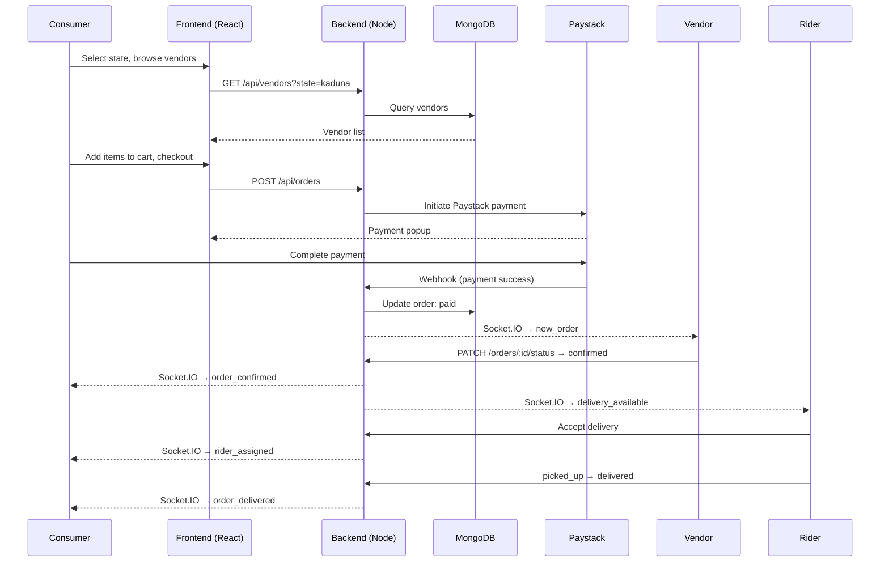

## Objective
Build a **world-class, content-rich food delivery web application** covering **Plateau State (Jos), Bauchi State, and Kaduna State** in Northern Nigeria. Modelled after Chowdeck/Glovo with a premium, elegant UI. Three user roles: **Consumer**, **Vendor**, **Rider**. Payments via Paystack.

---

## Tech Stack

| Layer | Technology |
|---|---|
| Frontend | React 18 + Vite + TypeScript |
| Styling | Tailwind CSS + Framer Motion (animations) |
| UI Components | shadcn/ui + Lucide Icons |
| State Management | Zustand (cart, auth, UI state) |
| Backend | Node.js + Express.js |
| Database | MongoDB + Mongoose |
| Auth | JWT (access + refresh tokens) + bcrypt |
| Payments | Paystack Inline JS |
| Real-time | Socket.IO |
| File Uploads | Cloudinary |
| Maps | Leaflet.js + OpenStreetMap |
| HTTP Client | Axios |

---

## Brand Identity & UI Direction

### Name: **NorthEats**
- **Tagline:** *"Fresh from the North, Delivered to Your Door"*
- **Color Palette:**
  - Primary: Deep Saffron `#F97316` (warm, food-forward)
  - Secondary: Forest Green `#16A34A` (fresh, natural)
  - Dark BG: Rich Charcoal `#1A1A2E`
  - Light BG: Warm White `#FAFAF7`
- **Typography:** Inter (body) + Playfair Display (headings) — elegant, premium feel
- **Style:** Glassmorphism cards, gradient hero sections, smooth micro-animations, sticky nav with blur backdrop

---

## Project Structure

```
northeats/
├── client/                          # React + TypeScript Frontend
│   ├── src/
│   │   ├── pages/
│   │   │   ├── Landing/             # Public marketing landing page
│   │   │   ├── Auth/                # Login, Register, Role selection
│   │   │   ├── consumer/
│   │   │   │   ├── Home/            # Vendor discovery + hero
│   │   │   │   ├── VendorPage/      # Full menu page
│   │   │   │   ├── Cart/            # Cart sidebar + checkout
│   │   │   │   ├── Orders/          # Order history + live tracking
│   │   │   │   └── Profile/         # Consumer profile
│   │   │   ├── vendor/
│   │   │   │   ├── Dashboard/       # Stats, revenue, charts
│   │   │   │   ├── MenuManager/     # Add/edit/delete items
│   │   │   │   ├── Orders/          # Live incoming orders
│   │   │   │   └── Profile/         # Vendor settings
│   │   │   └── rider/
│   │   │       ├── Dashboard/       # Earnings + stats
│   │   │       └── Deliveries/      # Active + available orders
│   │   ├── components/
│   │   │   ├── layout/              # Navbar, Footer, Sidebar
│   │   │   ├── ui/                  # shadcn/ui base components
│   │   │   ├── cards/               # VendorCard, FoodCard, OrderCard
│   │   │   ├── modals/              # Cart modal, Auth modal
│   │   │   └── shared/              # Rating, Badge, Spinner, Toast
│   │   ├── store/                   # Zustand stores (auth, cart)
│   │   ├── hooks/                   # useSocket, useCart, useAuth
│   │   └── services/                # Axios API calls, Paystack
└── server/                          # Node.js + Express Backend
    ├── models/                      # Mongoose schemas
    ├── routes/                      # Route declarations
    ├── controllers/                 # Business logic
    ├── middleware/                  # Auth, roles, error, upload
    ├── socket/                      # Socket.IO event handlers
    └── config/                      # DB, Cloudinary, Paystack
```

---

## World-Standard UI Pages & Content

### 1. Public Landing Page (`/`)
A **rich, full-page marketing experience** with multiple sections:

| Section | Content |
|---|---|
| **Hero** | Full-width video/image background, animated tagline, state selector (Plateau / Bauchi / Kaduna), CTA buttons (Order Now, Become a Vendor) |
| **How It Works** | 3-step animated process: Browse → Order → Delivered |
| **Featured Cities** | Cards for Jos, Bauchi, Kaduna with local food photography |
| **Popular Categories** | Icon grid: Rice, Soups, Grills, Snacks, Drinks, Sweets |
| **Top Vendors** | Horizontal scroll of top-rated restaurant cards |
| **Trending Foods** | Grid of food cards with pricing and ratings |
| **Promo Banner** | "First order 10% off" animated CTA strip |
| **App Features** | Icon + text feature blocks (Fast Delivery, Live Tracking, Secure Payment) |
| **Testimonials** | Customer review carousel with star ratings |
| **Vendor CTA** | "Partner with us" section for restaurant owners |
| **Rider CTA** | "Earn with NorthEats" section for dispatch riders |
| **Stats Bar** | Animated counters: Vendors, Orders Delivered, Cities, Happy Customers |
| **Footer** | Logo, links, social icons, newsletter signup, state coverage map |

### 2. Consumer Home (`/home`)
- **Sticky navbar** with location selector, search bar, cart icon, user avatar
- **State/LGA filter tabs**: Plateau | Bauchi | Kaduna
- **Search bar** with live food/vendor autocomplete
- **Banner carousel** (promotions & featured vendors)
- **Category pill filter** (All, Rice, Soup, Grills, Fast Food, Drinks…)
- **Vendor grid** — cards with cover image, logo, rating, delivery fee, ETA, open/closed badge
- **"Near You"** section (based on selected LGA)
- **"Popular Right Now"** horizontal scroll
- **"Try Something New"** curated picks

### 3. Vendor Menu Page (`/vendor/:id`)
- Full-width cover image + vendor logo + name + rating
- **Info bar**: LGA, Opening hours, Avg delivery time, Min order
- **Sticky category tabs** (scroll-spy) to navigate menu sections
- Food items in a **2-column card grid**: image, name, price, description, Add to Cart button
- Floating **Cart sidebar** or bottom drawer with item list, subtotal, checkout CTA

### 4. Checkout Page
- Order summary with items
- Delivery address input with LGA dropdown (per state)
- Delivery fee display (calculated by LGA zone)
- Paystack inline payment popup
- Order confirmation animation (Lottie)

### 5. Order Tracking Page (`/orders/:id`)
- **Progress stepper**: Placed → Confirmed → Preparing → Ready → Picked Up → Delivered
- Live updates via Socket.IO
- Rider info card (name, phone, vehicle type)
- Leaflet map showing rider location pin (if available)
- ETA countdown

### 6. Vendor Dashboard (`/vendor/dashboard`)
- Welcome banner with business name
- **Stats cards**: Today's Orders, Revenue, Pending, Completed
- **Line/bar chart** (Recharts): Weekly earnings
- **Live order queue** with real-time incoming orders (accept/reject)
- **Menu quick-edit** table

### 7. Rider Dashboard (`/rider/dashboard`)
- Online/offline toggle (prominent)
- **Available deliveries** list with pickup location, drop-off, distance, earnings
- Active delivery card with step-by-step status controls
- Earnings summary (today / week / total)

---

## Data Models (MongoDB)

### `User`
```
_id, name, email, phone, passwordHash, role, address, state, lga,
profileImage, isVerified, isActive, createdAt
```

### `Vendor`
```
_id, userId(ref), businessName, description, logo, coverImage,
state (plateau|bauchi|kaduna), lga, address, coordinates,
categories[], isOpen, isApproved, averageRating, totalOrders,
deliveryFee, minOrder, estimatedDeliveryTime, openingHours
```

### `FoodItem`
```
_id, vendorId(ref), name, description, price, image,
category, tags[], isAvailable, isPopular
```

### `Order`
```
_id, consumerId(ref), vendorId(ref), riderId(ref),
items[{foodItemId, name, qty, unitPrice}],
subtotal, deliveryFee, totalAmount,
paymentRef, paymentStatus (pending|paid|failed),
orderStatus (pending|confirmed|preparing|ready|picked_up|delivered|cancelled),
deliveryAddress, state, lga, createdAt, updatedAt
```

### `Rider`
```
_id, userId(ref), vehicleType, state, lga, isOnline,
currentLocation{lat,lng}, isApproved, averageRating, totalDeliveries
```

### `Review`
```
_id, orderId(ref), consumerId(ref), targetId(ref),
targetType (vendor|rider), rating (1-5), comment, createdAt
```

### `Promotion`
```
_id, title, description, image, vendorId(ref), discountType,
discountValue, validUntil, state[]
```

---

## API Endpoints

### Auth
- `POST /api/auth/register`
- `POST /api/auth/login`
- `POST /api/auth/refresh`
- `POST /api/auth/logout`

### Vendors
- `GET /api/vendors?state=plateau&lga=jos-north&category=grills` — filtered list
- `GET /api/vendors/:id` — full vendor + menu
- `POST /api/vendors` — create (vendor role)
- `PATCH /api/vendors/:id`
- `PATCH /api/vendors/:id/toggle-open`

### Food Items
- `GET /api/vendors/:id/items`
- `POST /api/items`
- `PATCH /api/items/:id`
- `DELETE /api/items/:id`

### Orders
- `POST /api/orders` — place order
- `GET /api/orders/:id`
- `GET /api/orders/consumer/me`
- `GET /api/orders/vendor/me`
- `GET /api/orders/rider/available`
- `PATCH /api/orders/:id/status`

### Payments
- `POST /api/payments/initiate`
- `POST /api/payments/verify`

### Reviews
- `POST /api/reviews`
- `GET /api/reviews/vendor/:id`

### Admin
- `GET /api/admin/vendors/pending`
- `PATCH /api/admin/vendors/:id/approve`
- `GET /api/admin/stats`

---

## System Flow



---

## State Coverage

| State | Key Cities/LGAs |
|---|---|
| **Plateau** | Jos North, Jos South, Bukuru, Barkin Ladi, Pankshin |
| **Bauchi** | Bauchi Metro, Azare, Misau, Katagum, Dass |
| **Kaduna** | Kaduna North/South, Zaria, Kafanchan, Soba, Birnin Gwari |

- Delivery fee structure per LGA zone (flat rate, configurable per vendor)
- State-specific food category highlights (Suya in Kaduna, Kilishi in Bauchi, Tuwo in Plateau)

---

## Implementation Steps

### Step 1 — Project Scaffold
- Initialize `client/` with Vite + React + TypeScript + Tailwind + shadcn/ui
- Initialize `server/` with Express + Mongoose + dotenv
- Set up MongoDB Atlas, Cloudinary, Paystack accounts
- Configure `.env` for both client and server

### Step 2 — Backend: Models + Auth
- Define all 6 Mongoose schemas
- Build JWT auth with role-based middleware (`isConsumer`, `isVendor`, `isRider`, `isAdmin`)
- Password hashing with bcrypt

### Step 3 — Backend: Core API
- Vendor CRUD + menu management routes
- Order placement + status state machine
- Paystack payment initiation + webhook verification
- Review submission and aggregation

### Step 4 — Real-time Layer
- Socket.IO server setup with room-based events per order
- Events: `new_order`, `order_status_update`, `rider_assigned`, `delivery_update`

### Step 5 — Frontend: Landing Page
- Build all 13 sections of the public landing page
- Framer Motion scroll animations, Lottie for hero illustration
- Fully responsive (mobile-first)

### Step 6 — Frontend: Auth Flow
- Register/Login modals with role selection (Consumer / Vendor / Rider)
- JWT storage in httpOnly cookie + Zustand auth store
- Protected route HOC per role

### Step 7 — Frontend: Consumer Flow
- Home page with state/LGA filter, category pills, vendor grid
- Vendor menu page with sticky category nav
- Cart drawer with Zustand store
- Checkout with Paystack inline popup
- Order tracking with Socket.IO + Leaflet map

### Step 8 — Frontend: Vendor Dashboard
- Stats overview cards + Recharts weekly earnings chart
- Real-time order queue with accept/reject
- Menu manager with Cloudinary image upload (drag & drop)

### Step 9 — Frontend: Rider Dashboard
- Online/offline toggle
- Available deliveries list
- Active delivery step controls

### Step 10 — Polish & World-Standard QA
- Skeleton loaders on all data-fetching pages
- Toast notifications (react-hot-toast) for all actions
- Full responsive audit (mobile / tablet / desktop)
- Empty states with illustrations
- 404 and error boundary pages
- Accessibility audit (ARIA labels, keyboard nav, color contrast)
- Paystack test-mode end-to-end payment flow test
- Performance: lazy-loaded routes, image optimization via Cloudinary transforms

### Step 11 — Deployment
- Backend → **Render** (free tier, auto-deploy from GitHub)
- Frontend → **Vercel** (auto-deploy from GitHub)
- MongoDB → **MongoDB Atlas** (M0 free cluster)

---

## Verification / Definition of Done

| Step | Target Files/Components | Verification |
|---|---|---|
| 1 | Project roots, `.env` files | Both dev servers run without errors |
| 2 | `server/models/`, `server/middleware/auth.js` | Register + login returns JWT for all 3 roles |
| 3 | `server/routes/`, `server/controllers/` | All endpoints return correct HTTP status via Postman |
| 4 | `server/socket/` | Order status update fires to correct client room |
| 5 | `client/pages/Landing/` | All 13 sections render, animations play |
| 6 | `client/pages/Auth/` | Role-based redirect works after login |
| 7 | `client/pages/consumer/` | Full order flow: browse → cart → Paystack → tracking |
| 8 | `client/pages/vendor/` | Vendor receives live order, can accept/reject |
| 9 | `client/pages/rider/` | Rider can accept and complete delivery |
| 10 | All pages | Lighthouse score ≥ 85, fully responsive on mobile |
