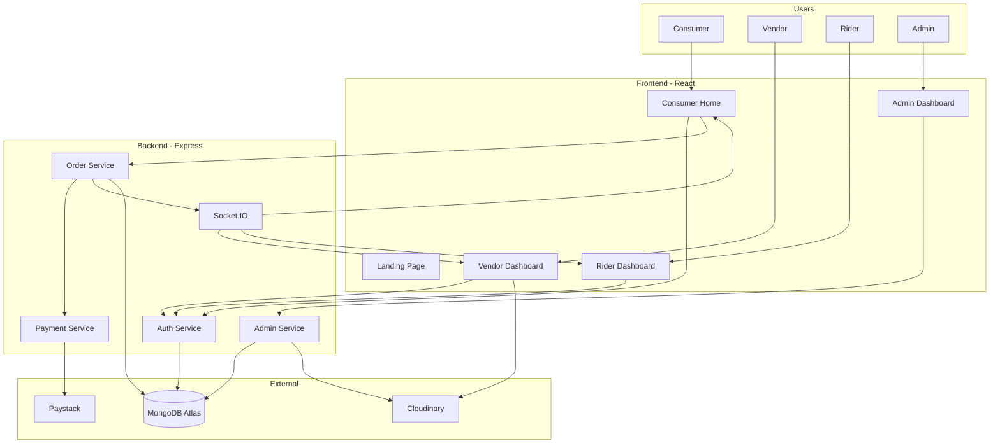

## Objective
Add a full-featured, world-standard **Admin Dashboard** to the NorthEats platform. The admin has supreme oversight over all vendors, riders, consumers, orders, payments, and platform content across all three states (Plateau, Bauchi, Kaduna).

---

## Admin Access & Auth

- Separate login page: `/admin/login` — email + password, role check (`admin`)
- All admin routes protected by `isAdmin` middleware
- Admin account seeded via a secure server-side script (not publicly registerable)
- Session stored in httpOnly cookie with short expiry + refresh token

---

## Admin Dashboard Structure

```
client/src/pages/admin/
├── AdminLayout.tsx          # Sidebar + topbar shell
├── Overview/                # Main dashboard landing
├── Vendors/
│   ├── VendorList.tsx       # All vendors table
│   ├── VendorDetail.tsx     # Single vendor view + approval
│   └── PendingApprovals.tsx # Unapproved vendors queue
├── Riders/
│   ├── RiderList.tsx        # All riders table
│   └── RiderDetail.tsx      # Single rider + approval
├── Consumers/
│   └── ConsumerList.tsx     # All consumers table
├── Orders/
│   ├── AllOrders.tsx        # Platform-wide order list
│   └── OrderDetail.tsx      # Full order breakdown
├── Payments/
│   └── Transactions.tsx     # All payment records
├── Reviews/
│   └── ReviewModeration.tsx # Flag/remove abusive reviews
├── Promotions/
│   └── PromotionManager.tsx # Create/edit/delete banners & promos
└── Settings/
    └── PlatformSettings.tsx # Delivery fees, commission rates, states
```

---

## Admin Sidebar Navigation

| Section | Icon | Description |
|---|---|---|
| Overview | Dashboard | KPI cards + charts |
| Vendors | Store | Manage + approve vendors |
| Riders | Bike | Manage + approve riders |
| Consumers | Users | View all consumer accounts |
| Orders | Receipt | All platform orders |
| Payments | CreditCard | Transaction history |
| Reviews | Star | Moderate reviews |
| Promotions | Tag | Manage banners & promo codes |
| Settings | Settings | Platform-wide config |

---

## Page-by-Page Breakdown

### 1. Overview Dashboard (`/admin`)
The command center — rich with data and visuals:

- **Top KPI Cards (animated counters):**
  - Total Orders (today / this week / all time)
  - Total Revenue (NGN)
  - Active Vendors (by state)
  - Active Riders (online now)
  - Registered Consumers
  - Pending Approvals badge

- **Charts (Recharts):**
  - Line chart: Daily orders over the last 30 days
  - Bar chart: Revenue by state (Plateau vs Bauchi vs Kaduna)
  - Pie chart: Orders by status (delivered, cancelled, pending)
  - Area chart: New user signups (consumers + vendors) over time

- **Recent Activity Feed:**
  - Latest 10 orders with status badge
  - Latest vendor registrations (pending approval highlighted)

- **Quick Action Buttons:**
  - Approve pending vendors
  - View flagged reviews
  - Create promotion

---

### 2. Vendor Management (`/admin/vendors`)

- **Vendor List table:** Name, State, LGA, Status (approved/pending/suspended), Rating, Total Orders, Date Joined, Actions
- **Filter/Search:** by state, status, name
- **Vendor Detail page:**
  - Full profile: logo, cover, business info, menu items count
  - Approve / Suspend / Unsuspend toggle
  - View all orders by this vendor
  - Revenue generated (total commission)
  - Reviews received
- **Pending Approvals queue** — highlighted tab with one-click approve/reject + rejection reason input

---

### 3. Rider Management (`/admin/riders`)

- **Rider List table:** Name, State, Vehicle, Status, Online/Offline, Total Deliveries, Rating, Date Joined, Actions
- **Rider Detail page:**
  - Profile info + documents (if uploaded)
  - Approve / Suspend toggle
  - Delivery history
  - Earnings summary

---

### 4. Consumer Management (`/admin/consumers`)

- **Consumer table:** Name, Email/Phone, State, Total Orders, Total Spent (NGN), Account Status, Date Joined
- **View consumer profile** — order history, addresses used, reviews written
- Suspend / unsuspend account

---

### 5. Orders Management (`/admin/orders`)

- **All Orders table:** Order ID, Consumer, Vendor, Rider, State, Amount, Payment Status, Order Status, Date
- **Filters:** by state, status, date range, vendor
- **Order Detail page:**
  - Full order breakdown: items, prices, delivery address, Paystack ref
  - Status override (admin can manually update stuck orders)
  - Assign or reassign rider
  - Issue refund trigger (via Paystack refund API)

---

### 6. Payments & Transactions (`/admin/payments`)

- **Transactions table:** Ref, Consumer, Vendor, Amount, Fee, Net, Payment Channel, Status, Date
- **Revenue summary cards:** Gross Revenue, Platform Commission, Paystack Fees, Net Payout
- **Export to CSV** button
- Filter by state, date range, status

---

### 7. Review Moderation (`/admin/reviews`)

- List of all reviews with rating, comment, author, target (vendor/rider)
- Flag indicator (auto-flagged if rating < 2 with keywords)
- **Delete review** action
- **Ban consumer** shortcut from review row

---

### 8. Promotions Manager (`/admin/promotions`)

- **Active Promotions list:** Title, States, Discount, Validity, Status
- **Create Promotion form:**
  - Title, description, image upload (Cloudinary)
  - Discount type: percentage or flat NGN
  - Target: platform-wide, specific state, or specific vendor
  - Valid from / until date
  - Promo code (optional)
- Edit / Deactivate / Delete

---

### 9. Platform Settings (`/admin/settings`)

- **Delivery Fee Config:** base fee per LGA zone (editable table per state)
- **Commission Rate:** platform % cut per order (e.g. 10%)
- **State/LGA Management:** add new coverage areas
- **Maintenance Mode Toggle:** disable app for all users
- **Support Contact Info:** phone, email displayed to users

---

## New Backend API Endpoints (Admin)

```
GET    /api/admin/stats                        # Overview KPIs
GET    /api/admin/vendors?status=pending       # Vendor list with filters
PATCH  /api/admin/vendors/:id/approve
PATCH  /api/admin/vendors/:id/suspend
GET    /api/admin/riders
PATCH  /api/admin/riders/:id/approve
PATCH  /api/admin/riders/:id/suspend
GET    /api/admin/consumers
PATCH  /api/admin/consumers/:id/suspend
GET    /api/admin/orders                       # All orders with filters
PATCH  /api/admin/orders/:id/status           # Override status
POST   /api/admin/orders/:id/refund           # Trigger Paystack refund
GET    /api/admin/payments                    # All transactions
GET    /api/admin/payments/export             # CSV export
GET    /api/admin/reviews
DELETE /api/admin/reviews/:id
GET    /api/admin/promotions
POST   /api/admin/promotions
PATCH  /api/admin/promotions/:id
DELETE /api/admin/promotions/:id
GET    /api/admin/settings
PATCH  /api/admin/settings
```

---

## UI Design Standards for Admin Panel

- **Layout:** Fixed left sidebar (collapsible) + sticky topbar with admin name, notification bell, logout
- **Theme:** Dark mode by default (charcoal `#1A1A2E` bg) with the same saffron accent color
- **Tables:** Sortable columns, pagination, row hover highlight, status color badges
- **Charts:** Recharts with smooth curves, tooltips, legend
- **Modals:** Confirmation dialogs for destructive actions (suspend, delete, refund)
- **Toasts:** Success/error feedback on every action
- **Skeleton loaders** on all data-fetching views
- **Responsive:** Collapsible sidebar on tablet; mobile view still functional

---

## Updated Full System Architecture



---

## Implementation Steps (Admin-Specific)

### Step A — Admin Auth & Layout
- `isAdmin` middleware guard on all `/api/admin/*` routes
- Admin login page at `/admin/login` with redirect to `/admin`
- `AdminLayout.tsx` — collapsible sidebar, topbar, outlet for child pages

### Step B — Overview & Stats API
- `GET /api/admin/stats` — aggregation pipeline in MongoDB for all KPI data
- Build Overview page with KPI cards + 4 Recharts charts

### Step C — Vendor & Rider Approval Flow
- Pending approvals queue with accept/reject + reason
- Suspension toggle with confirmation modal

### Step D — Orders & Payments
- All-orders table with advanced filters + status override
- Paystack refund API integration
- Transactions table with CSV export

### Step E — Promotions & Settings
- Full CRUD for promotions with Cloudinary image upload
- Settings page with live-editable delivery fee table per LGA

### Step F — Review Moderation
- Review list with delete action and consumer ban shortcut

---

## Verification / DoD (Admin)

| Step | Target | Verification |
|---|---|---|
| A | `AdminLayout`, `/admin/login` | Admin login redirects correctly; non-admin blocked |
| B | `Overview` page, `/api/admin/stats` | All KPI cards populate; charts render with real data |
| C | `VendorList`, `RiderList` | Approve/suspend actions update DB and reflect in UI |
| D | `AllOrders`, `Transactions` | Filter + export work; refund triggers Paystack API |
| E | `PromotionManager`, `PlatformSettings` | CRUD operations persist; settings affect delivery fee calc |
| F | `ReviewModeration` | Delete removes review from consumer-facing pages |
